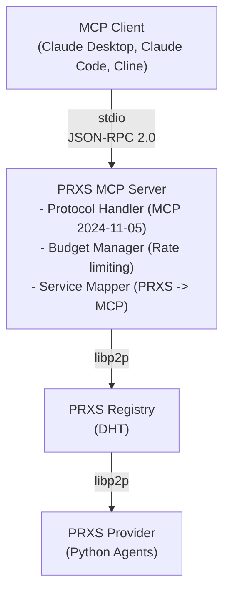

# PRXS MCP Server

Model Context Protocol integration for PRXS node, enabling MCP clients (Claude Desktop, Claude Code, Cline) to use PRXS services as native tools.

## Quick Start

### 1. Start Registry

**Windows:**
```bash
bin\registry.exe -key registry.key -port 5000 -api-port 8080
```

**Linux/macOS:**
```bash
./bin/registry -key registry.key -port 5000 -api-port 8080
```

### 2. Start Provider (calc example)

**Windows:**
```bash
bin\node.exe -mode provider ^
  -key provider.key ^
  -port 6000 ^
  -bootstrap "/ip4/127.0.0.1/tcp/5000/p2p/Qmaa5rxHHYqSop4bdnPADz1kzDnLqWyqGstD2YZ2VZctnn" ^
  -agent ai_tools/calc.py ^
  -stake-amount 12 ^
  -stake-chain mock-l2 ^
  -stake-proof calc_stake.json
```

**Linux/macOS:**
```bash
./bin/node -mode provider \
  -key provider.key \
  -port 6000 \
  -bootstrap "/ip4/127.0.0.1/tcp/5000/p2p/Qmaa5rxHHYqSop4bdnPADz1kzDnLqWyqGstD2YZ2VZctnn" \
  -agent ai_tools/calc.py \
  -stake-amount 12 \
  -stake-chain mock-l2 \
  -stake-proof calc_stake.json
```

### 3. Test MCP Server Standalone

**Windows:**
```bash
bin\node.exe -mode mcp-server ^
  -bootstrap "/ip4/127.0.0.1/tcp/5000/p2p/Qmaa5rxHHYqSop4bdnPADz1kzDnLqWyqGstD2YZ2VZctnn" ^
  -mcp-config mcp_config.yaml
```

**Linux/macOS:**
```bash
./bin/node -mode mcp-server \
  -bootstrap "/ip4/127.0.0.1/tcp/5000/p2p/Qmaa5rxHHYqSop4bdnPADz1kzDnLqWyqGstD2YZ2VZctnn" \
  -mcp-config mcp_config.yaml
```

## Architecture



## Implementation

### Core Components

**`mcp/server.go`** - MCP server entry point
- Starts stdio JSON-RPC 2.0 server
- Handles `initialize`, `tools/list`, `tools/call` methods
- Discovers registry via DHT and queries for services

**`mcp/protocol.go`** - MCP protocol types
- Request/response structures per MCP spec
- Tool schemas with JSON Schema validation
- Error codes (-32700 to -32003)

**`mcp/mapper.go`** - Service → Tool mapping
- Converts PRXS `ServiceCard` to MCP `Tool`
- Maps PRXS inputs to JSON Schema properties
- Handles parameter ordering and type inference

**`mcp/budget.go`** - Rate limiting
- Per-tool and global limits (minute/hour/day)
- Timeout enforcement
- In-memory counters (reset on restart)

**`mcp/config.go`** - Configuration loader
- Parses `mcp_config.yaml`
- Validates tool definitions and budgets

### MCP Methods

#### `initialize`
Handshake with client. Returns server info and capabilities.

```json
Request:  {"jsonrpc": "2.0", "id": 1, "method": "initialize",
           "params": {"protocolVersion": "2024-11-05", ...}}
Response: {"result": {"serverInfo": {"name": "PRXS MCP Server", "version": "0.1.0"},
                      "capabilities": {"tools": {}}}}
```

#### `tools/list`
Returns all enabled tools from config.

```json
Request:  {"jsonrpc": "2.0", "id": 2, "method": "tools/list"}
Response: {"result": {"tools": [{"name": "calculate", "description": "...",
                                  "inputSchema": {...}}]}}
```

#### `tools/call`
Executes a tool by:
1. Checking budget limits
2. Querying registry for service providers
3. Connecting to provider via libp2p
4. Sending JSON-RPC `compute` request
5. Returning result

```json
Request:  {"jsonrpc": "2.0", "id": 3, "method": "tools/call",
           "params": {"name": "calculate", "arguments": {"number": "25", "operation": "sqrt"}}}
Response: {"result": {"content": [{"type": "text", "text": "5.0"}], "isError": false}}
```

### Service Discovery Flow

1. **Startup**: MCP server connects to registry via bootstrap multiaddr
2. **Discovery**: Uses DHT `FindPeer` to locate registry peer ID
3. **Query**: Opens libp2p stream to registry with `find` method
4. **Cache**: Stores provider `AddrInfo` for subsequent calls
5. **Execution**: Direct libp2p stream to provider on each tool call

## Configuration

`mcp_config.yaml`:

```yaml
mcp:
  server_name: "PRXS MCP Server"
  version: "0.1.0"
  transport: "stdio"

tools:
  - prxs_service: "MathOracle-v1"     # PRXS service name
    mcp_name: "calculate"             # MCP tool name
    description: "Math calculations"  # Shown to users
    enabled: true                     # Enable/disable

budget:
  global:
    max_calls_per_minute: 30
  per_tool:
    calculate:
      max_calls_per_minute: 10
      timeout_sec: 5
```

## Claude Code Integration

Add to your project's `.mcp.json` or global MCP config:

**Windows:**
```json
{
  "mcpServers": {
    "prxs": {
      "command": "C:\\path\\to\\prxs-node\\bin\\node.exe",
      "args": [
        "-mode", "mcp-server",
        "-bootstrap", "/ip4/127.0.0.1/tcp/5000/p2p/Qmaa5rxHHYqSop4bdnPADz1kzDnLqWyqGstD2YZ2VZctnn",
        "-mcp-config", "C:\\path\\to\\prxs-node\\mcp_config.yaml"
      ]
    }
  }
}
```

**Linux/macOS:**
```json
{
  "mcpServers": {
    "prxs": {
      "command": "/home/user/prxs-node/bin/node",
      "args": [
        "-mode", "mcp-server",
        "-bootstrap", "/ip4/127.0.0.1/tcp/5000/p2p/Qmaa5rxHHYqSop4bdnPADz1kzDnLqWyqGstD2YZ2VZctnn",
        "-mcp-config", "/home/user/prxs-node/mcp_config.yaml"
      ]
    }
  }
}
```

### Example Usage in Claude Code

Once configured, Claude Code automatically discovers PRXS tools:

```
User: "What's the square root of 144?"

Claude Code: [Uses calculate tool automatically]
  Tool: calculate
  Input: {"number": "144", "operation": "sqrt"}
  Output: "12.0"

Claude Code: "The square root of 144 is 12."
```

**Multi-tool example:**
```
User: "Search for 'Ethereum gas fees' and calculate the square root of 2500"

Claude Code:
  [Uses web_search tool]
  Tool: web_search
  Input: {"query": "Ethereum gas fees"}
  Output: [search results...]

  [Uses calculate tool]
  Tool: calculate
  Input: {"number": "2500", "operation": "sqrt"}
  Output: "50.0"

Claude Code: "Here's what I found about Ethereum gas fees... Also, the square root of 2500 is 50."
```

### Running Multiple Providers

Start multiple agents to expose more tools:

**Windows:**
```bash
# Terminal 1: Registry
bin\registry.exe -key registry.key -port 5000 -api-port 8080

# Terminal 2: Math provider
bin\node.exe -mode provider -port 6000 -agent ai_tools/calc.py ...

# Terminal 3: Search provider
bin\node.exe -mode provider -port 6001 -agent ai_tools/tavily_search.py ...

# Terminal 4: Crypto provider
bin\node.exe -mode provider -port 6002 -agent ai_tools/gas_tracker.py ...
```

**Linux/macOS:**
```bash
# Terminal 1: Registry
./bin/registry -key registry.key -port 5000 -api-port 8080

# Terminal 2: Math provider
./bin/node -mode provider -port 6000 -agent ai_tools/calc.py ...

# Terminal 3: Search provider
./bin/node -mode provider -port 6001 -agent ai_tools/tavily_search.py ...

# Terminal 4: Crypto provider
./bin/node -mode provider -port 6002 -agent ai_tools/gas_tracker.py ...
```

Enable in `mcp_config.yaml`:
```yaml
tools:
  - prxs_service: "MathOracle-v1"
    mcp_name: "calculate"
    enabled: true
  - prxs_service: "TavilySearch-v1"
    mcp_name: "web_search"
    enabled: true
  - prxs_service: "GasTracker-v1"
    mcp_name: "gas_tracker"
    enabled: true
```

Claude Code will see all 3 tools and use them as needed.

## Budget & Rate Limiting

Prevents abuse and manages costs:

```yaml
budget:
  global:
    max_calls_per_minute: 30      # Total across all tools
    max_calls_per_hour: 500
  per_tool:
    web_search:                   # Expensive API
      max_calls_per_minute: 5
      timeout_sec: 30
    calculate:                    # Cheap operation
      max_calls_per_minute: 10
      timeout_sec: 5
```

When limit exceeded:
```json
{"error": {"code": -32003, "message": "tool 'web_search' rate limit exceeded: max 5 calls per minute"}}
```

## Error Handling

| Code | Name | Example |
|------|------|---------|
| -32700 | Parse error | Invalid JSON in request |
| -32600 | Invalid Request | Missing `jsonrpc` field |
| -32601 | Method not found | Unknown method `foo/bar` |
| -32602 | Invalid params | Missing required argument |
| -32001 | Tool not found | Tool `xyz` not in config |
| -32002 | Tool execution error | Provider unreachable |
| -32003 | Budget exceeded | Rate limit hit |

## Debugging

**Check MCP server logs:**

Windows:
```bash
bin\node.exe -mode mcp-server ... 2>&1 | tee mcp_server.log
```

Linux/macOS:
```bash
./bin/node -mode mcp-server ... 2>&1 | tee mcp_server.log
```

**Test tool discovery:**

Windows:
```bash
echo {"jsonrpc":"2.0","id":1,"method":"tools/list"} | bin\node.exe -mode mcp-server ...
```

Linux/macOS:
```bash
echo '{"jsonrpc":"2.0","id":1,"method":"tools/list"}' | ./bin/node -mode mcp-server ...
```

**Verify registry:**
```bash
curl http://localhost:8080/api/v1/services
```

**Check provider:**
```bash
curl http://localhost:8080/api/v1/services/MathOracle-v1
```
